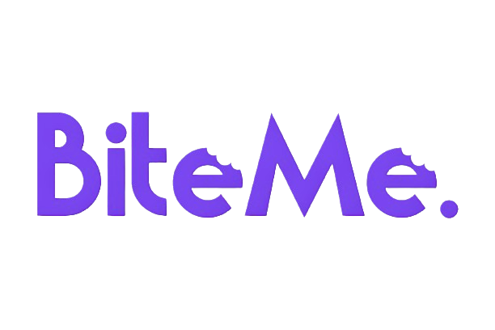

The "BiteMe" system is our project in the course "Engineering Methods For Software Systems Development" of "Braude" College of Engineering. 
The systems serves as a food ordering and delivering application.

The web-based app is a distributed software system connected to customers, suppliers (restaurants), and credit card companies. 

It enables the execution and operation of orders as well as centralized management of sales operations.
The system serves the company's branches (North, South and Central) and the company's management. 

The system includes a component called the User Portal, which serves as an operational environment through an internet interface, allowing system users to perform the relevant actions.

